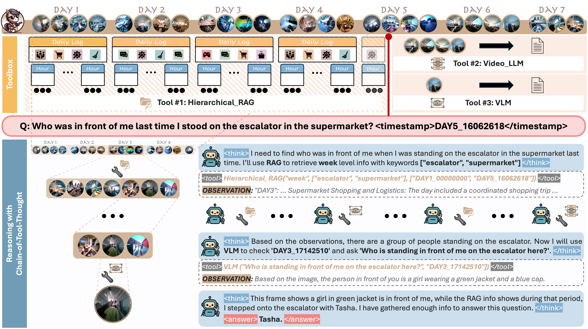

# Ego-R1: Agentic Chain-of-Tool-Thought for Ultra-Long Egocentric Video Reasoning
[](https://egolife-ai.github.io/Ego-R1/)
[]()
[](https://huggingface.co/Ego-R1)

[](https://discord.gg/tVaXWtY3Vu)
<!-- [](https://github.com//stargazers) -->
**TPAMI 2026**
<div>
  <a href="https://shulin16.github.io/">Shulin Tian</a><sup>*1,2</sup>,
  <a href="https://suikei-wang.github.io/">Ruiqi Wang</a><sup>*1,3</sup>,
  <a href="https://github.com/hongming21">Hongming Guo</a><sup>4</sup>,
  <a href="https://penghao-wu.github.io/">Penghao Wu</a><sup>1</sup>,
  <a href="https://scholar.google.com/citations?hl=zh-CN&user=kMui170AAAAJ">Yuhao Dong</a><sup>1</sup>,
  <a href="http://leowang980.github.io/">Xiuying Wang</a><sup>1</sup>,
  <a href="http://jingkang50.github.io/">Jingkang Yang</a><sup>1</sup>,
  <a href="https://www2.cs.sfu.ca/~haoz/">Hao Zhang</a><sup>3</sup>,
  <a href="https://hongyuanzhu.github.io/">Hongyuan Zhu</a><sup>2</sup>,
  <a href="https://liuziwei7.github.io/">Ziwei Liu</a><sup>1</sup>
  <br>
  <sup>1</sup>S-Lab, Nanyang Technological University&emsp; 
  <sup>2</sup>A*STAR, Singapore&emsp; 
  <sup>3</sup>Simon Fraser University&emsp; 
  <sup>4</sup>Shanghai AI Lab
</div>


<div style="width: 100%; text-align: center; margin:auto;">
    
</div>


**Ego-R1** is a comprehensive research framework that combines reinforcement learning-based tool-use reasoning with egocentric video analysis capabilities.

## 🔍 Project Overview

This repository provides:
- **Chain-of-Tool-Thought Generation (cott_gen)**: Multi-modal AI agents for analyzing egocentric video data with tool-calling capabilities (RAG, Video-LLM, VLM)
- **Ego-R1-Agent**: Reinforcement learning framework for training multiturn tool-use interleaved LLMs
- **Ego-R1 Dataset**: 25K Chain-of-Tool-Thought examples and 4.4K QA pairs

## 🌟 Key Features

- **Multi-modal Tool-Augmented Reasoning**: Combines RAG search, Video-LLM, and Vision-Language Models for long video understanding. Agents learn to use multiple tools to decompose and answer complex egocentric video questions
- **Reinforcement Learning**: GRPO training for thinking-reasoning-and-acting interleaved behavior
- **Comprehensive Dataset**: Release the code for CoTT data generation and pre-processed data for both SFT and RL training

## 📰 News

- [2025.6.8] Officially launch the Ego-R1 codebase.

## 🔗 Table of Contents
- [Repository Structure](#-repository-structure)
- [Installation](#-installation)
- [Quick Start](#-quick-start)
- [Usage Examples](#-usage-examples)
- [Dataset](#-dataset)
- [Acknowledgments](#-acknowledgments)
- [License](#-license)
- [Contributing](#-contributing)
- [Authors & Contact](#-authors--contact)
- [Citation](#-citation)

## 📁 Repository Structure

```
Ego-R1/
├── cott_gen/                # Chain-of-Tool-Thought generation for egocentric video QA
│   ├── main.py             # Main agent runner with multi-turn reasoning
│   ├── tools.py            # Tool implementations (RAG, Video-LLM, VLM)
│   ├── utils.py            # Utility functions and data processing
│   ├── prompts.py          # System and reasoning prompts
│   ├── postprocess.py      # Data postprocessing and analysis
│   └── environment.yml     # Conda environment for autogen
├── LLaMA-Factory/          # LLM fine-tuning framework (submodule)
├── Ego-R1-Agent/          # RL framework for reasoning + search LLMs
│   ├── train_grpo.sh       # GRPO training script
│   ├── train_ppo.sh        # PPO training script  
│   ├── eval/               # Inference and evaluation scripts
│   └── verl/               # veRL framework components
├── data/                   # Ego-R1 dataset (should be downloaded from HF)
│   ├── Ego-CoTT-25K/      # 25K Chain-of-Tool-Thought for SFT
│   ├── Ego-QA-4.4K/       # 4.4K QA pairs for RL training
│   └── Ego-CoTT-raw/      # Raw data in multiple formats
├── scripts/                # Training and generation scripts
│   ├── train/             # SFT training scripts
│   └── gen/               # Data generation scripts
└── api/                   # API components for RAG and visual tools
    ├── rag/               # RAG-related API components
    └── visual_tools/      # Multi-modal visual tool APIs
```

## 🔧 Installation

### Download Ego-R1-Data
```bash
huggingface-cli download Ego-R1/Ego-R1-Data --local-dir data --repo-type dataset
```

### Environment Setup
#### 0. Toolbox API Environment

i. **Set Environment**
   ```bash
   cd api/rag
   pip install -e .
   ```
   Make sure to install FFmpeg beforehand, as it is required for the visual tools to function properly.

ii. **Prepare the Data**
  For Egoschema and Videomme benchmark
   ```bash
   huggingface-cli download Ego-R1/h-rag_database --local-dir data --repo-type dataset
   ```
   Unzip the Videomme and Egoschema videos.

iii. **Setup API**
   - **Set GPT Key**
     ```bash
     export AZURE_OPENAI_ENDPOINT=ENDPOINT
     export AZURE_OPENAI_API_KEY=KEY
     ```

   - **Start RAG**
     - For Egolife/Ego-R1:
       - Set video directory in `rag/configs/egolife.yaml`:
         ```yaml
         base:
           data_dir: data/egolife # set to h-rag_database/egolife
         ```
       - Run:
         ```bash
         python api_for_egolife.py
         ```

     - For Egoschema:
       - Run:
         ```bash
         python api_for_egoschema.py --min_log_dir=h-rag_database/egoschema --port 6001 # default
         ```

     - For Videomme:
       - Run:
         ```bash
         python api_for_videomme.py --min_log_dir=h-rag_database/videomme/videomme_10min --sec_log_dir=h-rag_database/videomme/videomme_30s --port 7001 # default
         ```

iv. **Start Visual API**
   - **Set Config**
     - Set video directory in `visual_tools/configs.yaml` for EgoLife, Egoschema, and Videomme videos separately:
       ```yaml
       data_dir: "/path/to/egolife"
       data_dir: "/path/to/videomme"
       data_dir: "/path/to/egoschema"
       ```
     - Set any number of Gemini API keys:
       ```yaml
       gemini_api_keys: ["your-gemini-api-key-1", "your-gemini-api-key-2"]
       ```

   - **Run API**
     - For any visual API, run:
       ```bash
       python api.py
       ```
     - For LLaVA-based VideoLLM, run the LLaVA API first:
       ```bash
       python xxxx_videollm_llava/llava_video.py
       ```

#### 1. CoTT-Data-Generation Environment
```bash
# One-line installation
cd cott_gen
conda env create -f environment.yml
conda activate autogen


# Or install step by step:
# conda create -n autogen python=3.10
# conda activate autogen
# pip install -U autogenstudio==0.6.1
# pip install future google-genai
```

#### 2. SFT (LLaMA-Factory) Environment
```bash
cd LLaMA-Factory
pip install -e ".[torch,metrics]"
```

#### 3. RL (Ego-R1-Agent) Environment

```bash
conda create -n egor1 python=3.9
conda activate egor1

# Install PyTorch (optional - vllm can handle this)
pip install torch==2.4.0 --index-url https://download.pytorch.org/whl/cu121

# verl
pip install -e .

# flash attention 2
pip3 install flash-attn --no-build-isolation
pip install wandb google-genai
```
You can follow [Search-R1](https://github.com/PeterGriffinJin/Search-R1) to build the environment as well.

## 🚀 Quick Start
### Inference
#### 1. Test the model
```bash
bash Ego-R1-Agent/utils/serve.sh
```
#### 2. Inference on the benchmark
```bash
conda activate egor1

# with a summary model
bash Ego-R1-Agent/eval/infer_bench_summ.sh

# or you can go with a basic one
# python infer.py --arg1 xxx --arg2 xxx
```

### 1. Supervised Fine-Tuning (SFT)
```bash
# Prepare data
mkdir -p LLaMA-Factory/data 
cp data/Ego-CoTT-25K/train-cott.json LLaMA-Factory/data/

# Train model
conda activate llamafactory
cd LLaMA-Factory
llamafactory-cli train examples/train_full/qwen.yaml
```

### 2. Reinforcement Learning Training
```bash
# Prepare data
mkdir -p Ego-R1-Agent/data
cp data/Ego-CoTT-raw/*.parquet Ego-R1-Agent/data/

# Start RL training
conda activate egor1
cd Ego-R1-Agent
bash train_grpo.sh  # For GRPO training
```

### 3. Chain-of-Tool-Thought Generation
```bash
# Generate reasoning traces with multi-modal tools
conda activate autogen
bash scripts/gen/run_data_gen.sh
```

## 🔬 Usage Examples

### Multi-Modal Reasoning Process

The Ego-R1 agent uses a structured chain-of-tool-thought approach:

1. **Think**: Analyze the question and plan the reasoning approach
2. **RAG Search**: Retrieve relevant context from video databases across different time granularities
3. **Video-LLM**: Analyze specific video segments for detailed understanding
4. **VLM**: Extract visual details from specific frames when needed
5. **Answer**: Provide reasoned response based on collected evidence

### Tool Usage Examples

#### RAG Search
```python
{
    "name": "rag",
    "arguments": {
        "level": "day",  # or "week", "hour"
        "keywords": ["cooking", "kitchen"],
        "start_time": "DAY1_11210217",
        "query_time": "DAY1_11220217"
    }
}
```

#### Video Analysis
```python
{
    "name": "video_llm", 
    "arguments": {
        "question": "What cooking action is being performed?",
        "range": "DAY1_11210217-DAY1_11220217"
    }
}
```

#### Image Analysis
```python
{
    "name": "vlm",
    "arguments": {
        "question": "What objects are visible on the table?",
        "timestamp": "DAY1_11210217"
    }
}
```


## 📊 Dataset

### Ego-CoTT-25K
- **Size**: 25,000 examples (415MB)
- **Format**: Multi-turn conversations with tool calls
- **Purpose**: Supervised fine-tuning
- **Tools**: RAG, Video-LLM, VLM integration

### Ego-QA-4.4K  
- **Size**: 4,400 QA pairs
- **Sources**: 1.5K Gemini-generated + 2.9K manual annotations
- **Agents**: 6 different identities (A1-A6)
- **Purpose**: Rule-based reinforcement learning training or generating CoTT from scratch


## 🙏 Acknowledgments

This project builds upon several excellent open-source frameworks:
- **[autogen](https://github.com/microsoft/autogen)**: Foundation for multi-agent conversations and tool calling
- **[veRL](https://github.com/volcengine/verl)**: Reinforcement learning framework for LLM training
- **[LLaMA-Factory](https://github.com/hiyouga/LLaMA-Factory)**: Comprehensive LLM fine-tuning platform
- **[Search-R1](https://github.com/PeterGriffinJin/Search-R1)**: RL framework for reasoning + search capabilities
- **[DeepSeek-R1](https://github.com/deepseek-ai/DeepSeek-R1)**: Inspiration for reasoning model architecture

## 📄 License

This project is licensed under the Apache License 2.0. See the LICENSE files in individual components for details.

## 🤝 Contributing

Contributions are welcome! Please feel free to submit issues, feature requests, or pull requests to help improve this research framework.

## 👨‍💻 Authors & Contact

If you have any queries, feel free to contact: Shulin Tian (shulin002@ntu.edu.sg) & Ruiqi Wang (rwa135@sfu.ca)

## 📚 Citation

```bibtex
@article{tian2026ego,
  title={Ego-R1: Agentic Chain-of-Tool-Thought for Ultra-Long Egocentric Video Reasoning},
  author={Tian, Shulin and Wang, Ruiqi and Guo, Hongming and Wu, Penghao and Dong, Yuhao and Wang, Xiuying and Yang, Jingkang and Zhang, Hao and Zhu, Hongyuan and Liu, Ziwei},
  journal={IEEE Transactions on Pattern Analysis and Machine Intelligence},
  year={2026},
  publisher={IEEE}
}
```
